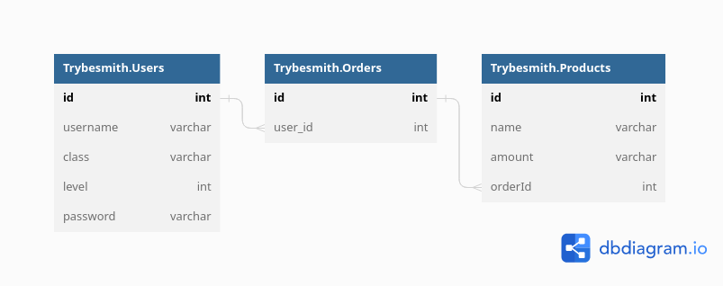

# Projeto TrybeSmith: RESTfull API em POO seguindo princípios SOLID

<!-- <h1 align="center">Stack</h1> -->

# Stack

---

<a href="https://skillicons.dev">

</a>

<a href="https://skillicons.dev">

</a>

<a href="https://skillicons.dev">

</a>

<a href="https://skillicons.dev">

</a>

---

# Descrição

Projeto de encerramento do Bloco 8 do módulo Back-End do curso de
Desenvolvimento Web na Trybe.

Representa a API de uma loja de _itens medievais_ desenvolvida seguindo a
arquitetura MSC (Models, Service e Controllers) que define **endpoints** para
leitura e escrita (CRUD) em um determinado banco de dados relacional.

## Objetivos do estudo

- Explorar conceitos de **Programação Orientada a Objetos** na construção de uma
  API RESTfull seguindo princípios **SOLID**.

## Como rodar o projeto:

  ### Rodando no Docker vs Localmente</strong></summary><br />
  
  - **Com Docker**

- Antes de tudo, configure as variáveis de ambiente com dados da sua conexão
  MySQL. As variáveis estão no arquivo `env-example`, renomeie esse arquivo para
  `.env`.

> Rode os serviços `node` e `db` com o comando `docker-compose up -d`.

- Lembre-se de parar o `mysql` se estiver usando localmente na porta padrão
  (`3306`), ou adapte, caso queria fazer uso da aplicação em containers

- Esses serviços irão inicializar um container chamado `trybesmith` e outro
  chamado `trybesmith_db`.

- A partir daqui você pode rodar o container `trybesmith` via CLI ou abri-lo no
  VS Code.

> Use o comando `docker exec -it trybesmith bash`.

- Ele te dará acesso ao terminal interativo do container criado pelo compose,
  que está rodando em segundo plano.

> Instale as dependências com `npm install`

⚠ Atenção ⚠ Caso opte por utilizar o Docker, **TODOS** os comandos disponíveis
no `package.json` (npm start, npm run dev, etc.) devem ser executados **DENTRO**
do container, ou seja, no terminal que aparece após a execução do comando
`docker exec` citado acima.

⚠ Atenção ⚠ Caso você esteja usando macOS e ao executar o `docker-compose up -d`
é possível que se depare com o seguinte erro:

```bash
The Compose file './docker-compose.yml' is invalid because:
Unsupported config option for services.db: 'platform'
Unsupported config option for services.node: 'platform'
```

Encontrei 2 possíveis soluções para este problema:

> 1. Você pode adicionar manualmente a option `platform: linux/amd64` no service
>    do banco de dados no arquivo docker-compose.yml do projeto.
> 2. Você pode adicionar manualmente nos arquivos .bashrc, .zshenv ou .zshrc do
>    seu computador a linha `export DOCKER_DEFAULT_PLATFORM=linux/amd64`, essa é
>    uma solução global.

As soluções foram com base [nesta fonte](https://stackoverflow.com/a/69636473).

---

- **Sem Docker**

Instale as dependências com `npm install`.

⚠ Para rodar o projeto desta forma, obrigatoriamente você deve ter o `node` 16+
instalado em seu computador.

--- 

[**Diagrama entidade relacionamento do banco de dados usado no estudo:**](https://dbdiagram.io/d/632f07987b3d2034ffa76c90)


